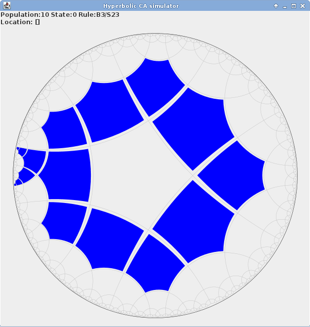

Hyperbolic Cellular Automation Simulator
========================================

This program is a simulator of totalistic 2-state cellular automata on hyperbolic tiling [{5,4}](http://en.wikipedia.org/wiki/Order-5_square_tiling).
Simply speaking, it's a Game of Life in the hyperbolic space.

Usage
-----

To run the program, execute pentagrid.jar:

    $ java -jar pentagrid-0.1.jar

The GUI shows field {5;4} hyperbolic tesselation. Use mouse to toggle cell states.
    
### Hotkeys
For now, there is no GUI controls, only hotkeys are used.

#### Simulation
* SPACE - simulate one step
* ENTER - start/stop continuous simulation
* d - clear field
* x - set new rule (see Rules)
* r - create random field of some small radius
      		
#### Navigation
* c - jump to the center (useful if you have got lost far away)
* arrow keys - move through the hyperbolic space
* [, ] - rotate view

* z - run search for the cell clusters
* o,p - go to the next/previous cell cluster (from the found previously) 

#### View
* g - toggle grid visibility
* a - toggle anti-aliasing

#### Files
* s - save field
* l - load field
* e - export current view as PNG image
* t - edit settings (for now, only "Export image size" option is working)
* n - export multiple frames (animation). Several files with numeric indices are generated.
* m - export multiple frames with offset. Useful for making smooth animations of moving spaceships. Allows to specify total number of gernations, number of frames per generation and amount of vertical offset (in pentagon side lengths).

	   
Rules
-----
Supported automata are binary (cells are either dead or alive) and totalistic. The latter means that the next state of the cell depends only on the total number of alive neighbors. This program uses 10-cell neighborhood (analogous to the Moore neighborhood in regular CA).

Rules are specified in the standard B/S notation. For example, "B3/S23" describes the following rule:
* Cell "born" (i.e. changes state from 0 to 1), if it has 3 alive neighbors.
* Cell "survive" (i.e. holds state 1), if it has 2 or 3 alive neighbors.
* In the all other cases, cell "dies" (its state becomes 0).

To denote 10 alive neighbors, use letter "a". Rule strings are case-insensitive, "/" is optional. 

Generally, rules containing B0 can not be simulated by this program since they produce infinite amounts of alive cells.
The only exception are the *Strobing* rules, which have B0, but not have Sa. In such rules, empty space changes to filled space,
and filled space changes to empty space back. This allows to represent such rules as combination of 2 normal rules.
Interestingly, there are rules in this class, that [support gliders and not explosive](http://dmishin.blogspot.com/2014/10/cellular-automata-on-hyperbolic-54.html).

Technical characteristics
-------------------------
Field size is limited only by computer memory. However, note that in hyperbolic space, number of cells grows exponentially with area size.
In addition to this, algorithms are not very memory-effective. On default settings, you can catch memory exception when cell count reaches 150'000.
By increasing Java heap space (run java --help for options), you can increase this limit to 300-400k cells. However, simulation is very slow for such sizes.
	
Supports infinite-sized field!

Compilation
-----------
Depends on the Google GSON library, used for data serializaiton. 
From it, only google-gson-stream library is needed (object mapper is not used).
